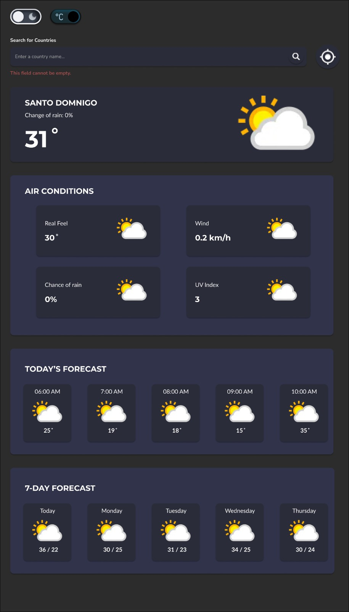

# Weather App

**Description**
This weather app provides real-time weather information for any location worldwide. It leverages a reliable weather API to fetch accurate data, including:

- **Current Weather:**
  - Temperature
  - Humidity
  - Wind speed and direction
  - Weather condition (e.g., sunny, rainy, cloudy)
- **Forecast:**
  - Daily forecasts for the next several days
  - Hourly forecasts for the current day

**Features**

- Intuitive User Interface
- Accurate Weather Data
- Location-Based Weather
- Dark Mode

**Getting Started**

1. **Clone the Repository:**

   ```bash
   git clone https://github.com/neshgogo/weather-app.git

   ```

2. **Install Dependencies:**

    ```bash
    cd weatherWeb
    npm install
    ```
3. **Run the App:**
    ```
    ng serve
    ```

### APP Design
